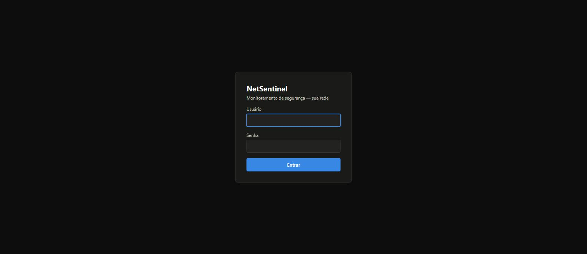
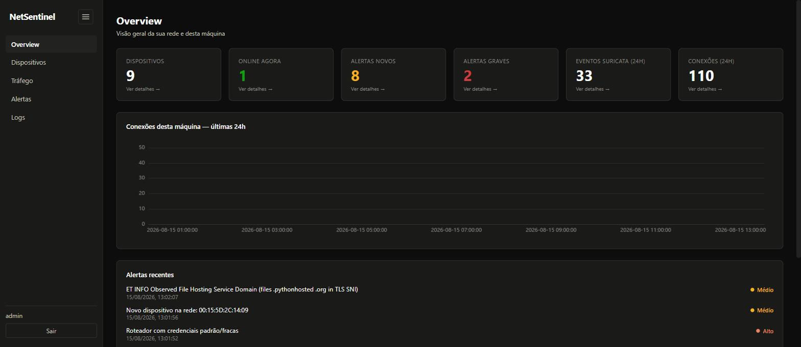
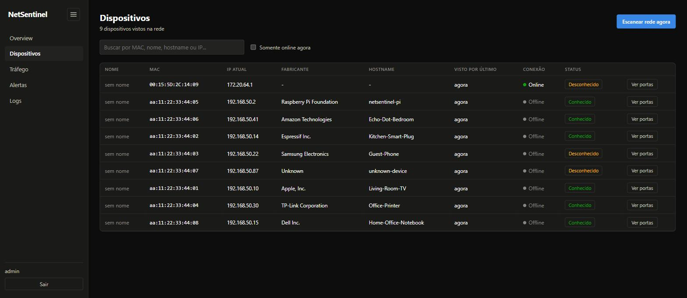
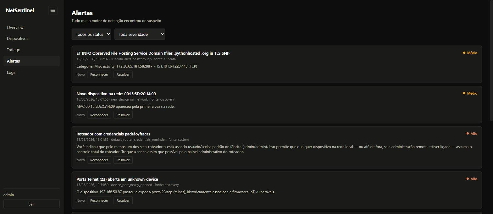
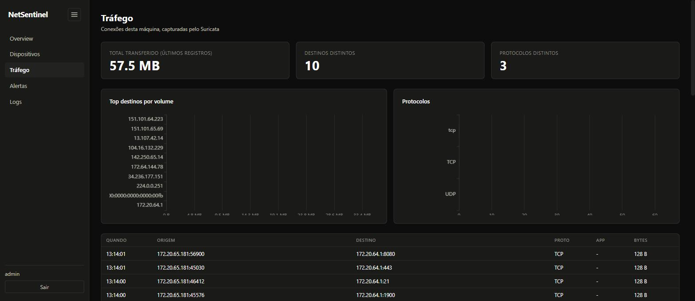

# NetSentinel

   

Ferramenta open source de monitoramento de segurança para a sua rede doméstica.

Mostra dispositivos conectados, tráfego desta máquina em nível de pacote (via
[Suricata](https://suricata.io/)), e alertas de segurança — via dashboard web
(dark mode) e via TUI de terminal. Roda inteiramente em Docker Compose; pensado
para rodar hoje num notebook Linux e depois, sem mudanças, num Raspberry Pi.

## Por que existe

A maioria das soluções de "segurança doméstica" ou pede acesso ao roteador, ou
te empurra pra um appliance fechado, ou faz coisas invasivas (ARP/DNS
spoofing, monitor mode) pra enxergar o tráfego de outros aparelhos. O
NetSentinel foi desenhado para nunca precisar disso: ele só olha o que já
chega até a própria máquina onde roda (unicast) mais broadcast/multicast/ARP
— o suficiente pra descobrir dispositivos na rede e inspecionar o próprio
tráfego, sem interceptar ninguém. Ver
**[docs/PHASE1_SCOPE.md](docs/PHASE1_SCOPE.md)** para o limite exato (e o
porquê) antes de mexer nos coletores ou nas regras de alerta.

## Screenshots

| Login | Overview |
|---|---|
|  |  |

| Dispositivos | Alertas |
|---|---|
|  |  |

| Tráfego |
|---|
|  |

*(dados de exemplo — dispositivos e nomes fictícios, gerados com
`backend/app/seed_demo.py`; os alertas do Suricata e o gráfico de tráfego são
reais, capturados durante o desenvolvimento)*

## Funcionalidades

- **Descoberta de dispositivos** na LAN via ARP passivo/ativo e mDNS/SSDP —
  MAC, IP, fabricante (OUI), hostname, portas abertas, primeira/última vez
  visto.
- **Inspeção de tráfego** desta máquina em nível de pacote via Suricata
  (af-packet), com o ruleset Emerging Threats Open.
- **Motor de alertas** baseado em regras: dispositivo novo, porta nova
  aberta, IP mudou, pico de dispositivos novos, gateway com interface
  administrativa exposta, hits de assinatura do Suricata.
- **Dashboard web** (React + TypeScript + Vite, dark mode, gráficos com
  Apache ECharts) e **TUI de terminal** (Python Textual) — os dois falam com
  a mesma API REST/WebSocket, então funcionam em paralelo (dashboard no
  navegador, TUI numa sessão SSH pro Raspberry Pi).
- Alertas em tempo real via WebSocket.
- Zero dependência de nuvem, zero telemetria: tudo roda local, em SQLite.

## Setup rápido

```bash
cp .env.example .env
./scripts/install_host_deps.sh   # instala só o Docker (revise o script antes de rodar)
./scripts/generate_secrets.sh    # gera SECRET_KEY e a senha do admin
./scripts/detect_interface.sh    # detecta a interface de rede e o CIDR da LAN
docker compose up -d --build
```

Depois:
- Dashboard web: `http://<ip-desta-maquina>` (porta 80, acessível de qualquer
  aparelho na sua LAN, com login).
- TUI: `docker compose exec backend python -m tui` (ou rode a TUI localmente,
  ver `tui/README.md`).

Quer só ver a interface populada sem depender de tráfego real da sua rede?
`docker compose exec backend python -m app.seed_demo` cria dispositivos,
alertas e conexões fictícios (não sobrescreve dados reais, só adiciona).

## Raspberry Pi

Ver [docs/SETUP.md](docs/SETUP.md).

## Arquitetura

Ver [docs/ARCHITECTURE.md](docs/ARCHITECTURE.md) — Suricata + coletores
(ARP/mDNS/nmap) alimentando um backend FastAPI/SQLite, consumido por um
frontend React e por uma TUI, ambos pela mesma API REST/WebSocket.

## Desenvolvimento

```bash
cd backend
pip install -e ".[dev]"
pytest              # roda a suíte de testes
ruff check .        # lint
alembic upgrade head  # aplica a migração baseline num banco novo
```

## Status do projeto

Fase 1 (descrita em [docs/PHASE1_SCOPE.md](docs/PHASE1_SCOPE.md)) está
funcional e é o que está documentado aqui. v0.1.0: primeira release pública,
com suíte de testes automatizados (alert engine + API), CI no GitHub Actions
e migração Alembic baseline versionada — o schema ainda nasce via
`create_all` no boot (self-hosted, instalação única, sem histórico de deploy
a preservar), mas qualquer mudança de schema daqui pra frente vira revisão
Alembic. Próximo passo natural: Fase 2 (integração opcional e explícita com
o roteador).

## Licença

[MIT](LICENSE) — © 2026 TGR Technology.
